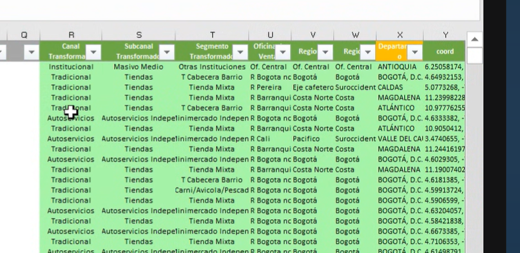

Primer archivo  Universo de la directa ( Archivo semáforo ). 
Clientes. 

- Hay 4 drivers : Municipio , transformados y Regional, y **coordenadas.** => Se trae información con  buscar V

- El universo de cliente normal : (DB) => Traer coordenadas / Departamento .
- El departamento se trae del driver
- Y las coordenadas se traen desde la hoja (DB inicio Mes) : DE AQUÌ SE TRAEN LAS COORDENADAS , Y SE CONTENAN SEPARADAS POR ","
- Ordenar por orden interlocutor (Función Inter) y eliminar duplicados.

- Cod Cliente se duplica 2 veces al final. 
Conservar solo las columnas que tengo en verde. El resultado queda como la Dinámica universo Directa (No agrupa).  

Debemos tomar la otra hoja: DB Inicio Mes. 
- Ordenar por orden interlocutor (Función Inter) y eliminar duplicados.
- Eliminar primeros dos caracteres columna NºCliente.
- Busca en dinámica universo el cliente / si no encuentra este cliente lo marca. Si ya existe en dinámica universo se eliminan estos clientes. 
- Se treaen todas estas columnas de los clientes. 

Luego toman las columnas verdes y las nuevas que se trajo ( Al final se fusionan ambas bases DB univeros dinamica y DB Inicio Mes dinàmica.)