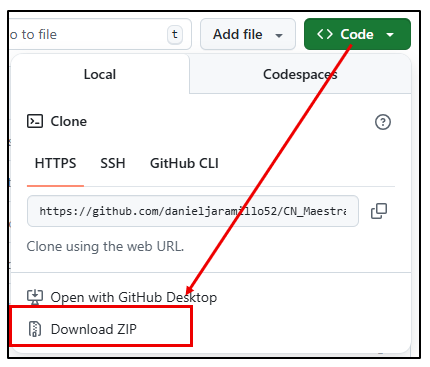
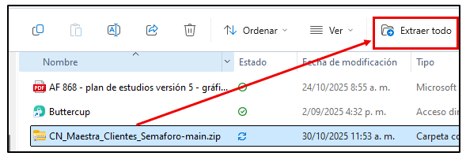
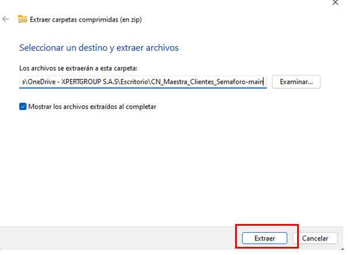
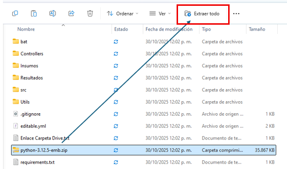
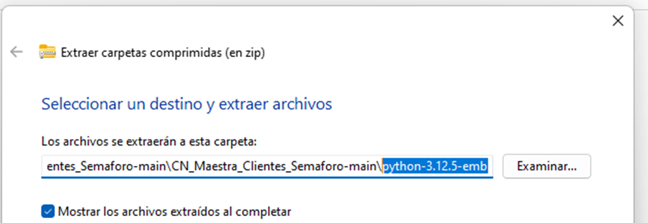
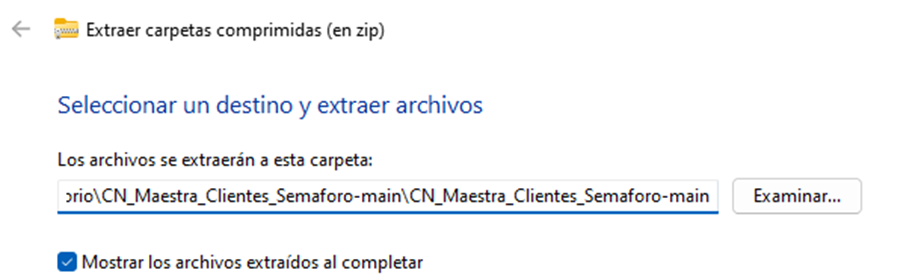

# CN_Maestra_Clientes_Semaforo

## Descripción
**CN_Maestra_Clientes_Semaforo** automatiza la **consolidación, limpieza y normalización** de universos de clientes (Directa / Indirecta) a partir de insumos Excel definidos en manifiestos (`*.txt`). El flujo genera universos depurados y reportes auxiliares, dejando trazabilidad en `Resultados/`.

> La **estructura esperada de cada archivo** (columnas, hojas, tipos) está documentada en **`docs/Estructura archivos Insumos.xlsx`**. Revísala antes de ejecutar el proceso.

---

## Objetivos
- Unificar y estandarizar universos **Directa** e **Indirecta**.
- Aplicar reglas de normalización / renombre / controles de nulos y duplicados.
- Integrar información auxiliar mediante *drivers.xlsx*.
- Exportar universos consolidados y reportes de calidad mínimos con trazabilidad.

---

## Estructura de Insumos 
```
Insumos/
├─ Directa/
│  ├─ Base Inicio Mes - Directa.xlsx
│  ├─ Universo de Clientes - Directa.xlsx
│  └─ Insumos_directa.txt         # Manifiesto: lista de archivos a consumir para Directa
│
├─ Drivers/
│  ├─ Drivers Universos.xlsx
│  └─ drivers.txt                 # Manifiesto: drivers/hojas a usar
│
└─ Indirecta/
   ├─ Base Inicio Mes - Indirecta.xlsx
   ├─ Universo de Clientes - Indirecta.xlsx
   └─ Insumos Indirecta.txt       # Manifiesto: lista de archivos a consumir para Indirecta
```
> **Manifiestos (`*.txt`)**: una ruta/archivo por línea (relativa a la carpeta). contiene los insumos que correcponden a cada carpeta. (Consulta / puede eliminarse)

---

## Salidas (definitivas) en `Resultados/`
| Archivo | Descripción |
|---|---|
| `universo_directa_completo.xlsx` | Universo Directa consolidado y normalizado. |
| `universo_indirecta_completo.xlsx` | Universo Indirecta consolidado y normalizado. |
| `df_municipios_nulos.xlsx` | Registros con **faltantes** críticos de municipio/departamento para revisión. |
| `Resultados.txt` |Lista de resultados esperados de ejecución. (Consulta / Se puede eliminar)

---

## Tecnologías y librerías
- **Python 3.12** (compatible con distribución **embebida**).
- `pandas`, `openpyxl`, `pyxlsb`, `PyYAML`, `loguru` (y dependencias).
- Módulos internos en `Utils/`: transformaciones y utilidades comunes.

---

## Instalación
### Opción A — Python estándar
```bash
git clone https://github.com/danieljaramillo52/CN_Maestra_Clientes_Semaforo.git
cd CN_Maestra_Clientes_Semaforo
pip install -r requirements.txt --disable-pip-version-check
```
(La opción A, se contempla al contar con python 3.12 instalado previamente.)


### Opción B — Distribución **embebida** (Windows)
## Instalación. 

1. Descargar (.zip) desde el repositorio del proyecto.  (Recomendado: Dejar la carpeta del proyecto en un lugar de facil acceso)



2. Descomprimir el proyecto **Plano_Rent-main.zip**





3. Descomprimir el archivo **python-3.12.5-embed.zip** en el directorio actual. 



Previo a extraer **eliminamos el nombre de la carpeta** que vamos a descomprimir de la ruta. 





En el caso actual eliminamos el nombre de la carpeta  luego **Presionamos el boton extraer.**

**Nota**: El directorio actual es de los archivos del proyecto. **CN_Maestra_Clientes_Semaforo** esta carpeta se genera al descomprimir con el sistema de archivos de windows. 

Nos debe quedar la carpeta: 


4. Ingresamos a la carpeta ``bat`` y presionamos sobre ``iniciar.bat`` para instalar todos los componentes del proyecto. doble click sobre este archivo. (Doble click sobre el archivo. ).
---

## Flujo de alto nivel
1. **Carga de configuración** (YAML/constantes) y lectura de **manifiestos** `*.txt`.
2. **Lectura de Excel** (Directa / Indirecta / Drivers) con validaciones de hoja y columnas (según `docs/Estructura archivos Insumos.xlsx`).
3. **Transformaciones**:
   - Normalización de strings (trim, normalización de mayúsculas/minúsculas).
   - Renombrado/mapeo de columnas.
   - Reemplazo de nulos por columna según diccionarios.
   - Controles de duplicados y llaves.
4. **Integración con Drivers** (territorios/auxiliares) y reglas de cruce.
5. **Exportación** de universos y **reportes** de nulos críticos.

---

## Buenas prácticas
- Mantén los **nombres de hojas** y **columnas** exactamente como indica `docs/Estructura archivos Insumos.xlsx`.
- Usa el archivo **editable.yaml** para agregar/quitar información sin editar código.

---

